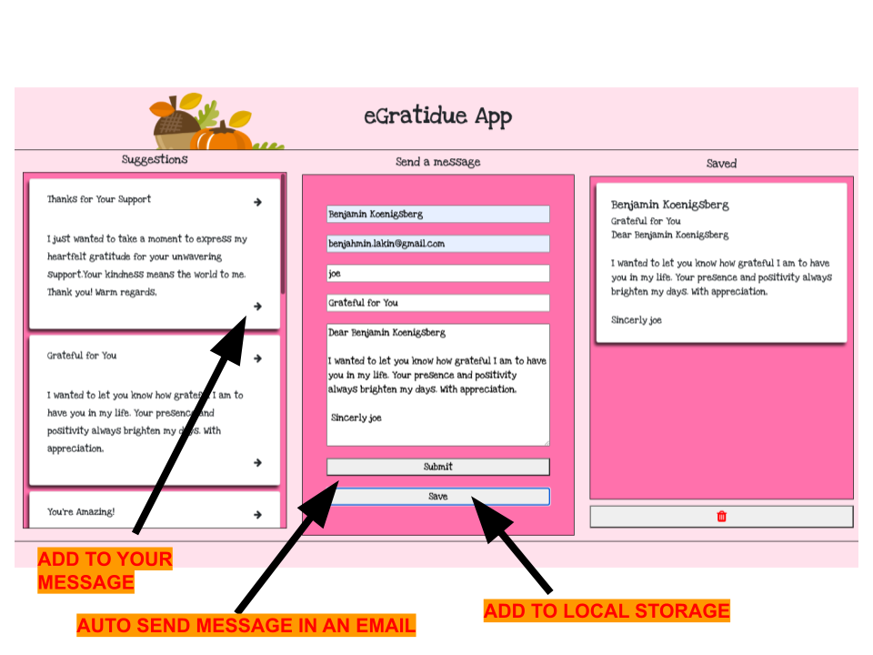

<!-- ABOUT THE PROJECT -->
## About The Project

#### Skills Based Assesment 316

This assessment from [Per Scholas](https://perscholas.org) measures your understanding of the Document Object Model (DOM) and your capability to implement its features in a practical manner.

### Objectives

- Use DOM properties, methods, and techniques to create a web application that provides a dynamic user experience.

- Use BOM properties, methods, and techniques to facilitate creation of a dynamic web application.

- Demonstrate proficiency with event-driven programming and DOM events.

- Implement basic form validation using any combination of built-in HTML validation attributes and DOM-event-driven JavaScript validation.

### Instructions

You will create a small single-page web application.


## About
This is a gratitude email generating app. Fill in the form fields and click on the arrow for one of the suggested email subjects and / or message

Click submit to auto email your message to your reciepient
Click save to save your messgaes in the 'saved' area and to your local storage




<!-- LIVE SITE -->
## Visit The LIve Site
https://sba-316.netlify.app/

### A few grading requirements with usage examples

Use the parent-child-sibling relationship to navigate between elements at least once (firstChild, lastChild, parentNode, nextElementSibling, etc.).

```
   const cardBody = document.createElement('div')
    cardContainer.append(cardBody)
    //use first child method
    cardContainer.firstChild.classList.add('card-body')
```

Iterate over a collection of elements to accomplish some task.

```

function getStorage(){

    for (let i = 0; i <= localStorage.length; i++) {
        let item = localStorage.getItem(localStorage.key(i));
        if ( item !== "INFO" && item !== null && item !== undefined)
            savedArray.push(JSON.parse(item));
    }
}

```

Register at least two different event listeners and create the associated event handler functions.

```
window.addEventListener('load', ()=>{
    getStorage()
}

clearBtn.addEventListener('click', clearItems)

```

### Built With


* HTML / CSS
* JavaScript
* Font Awesome
* Local storage


<!-- ACKNOWLEDGMENTS -->
## Acknowledgments

This site is completely has been initated and supported by the wonderful teachers at Per Scholas

* [Per Scholas](https://perscholas.org)


<!-- CONTRIBUTING -->
## Contributing

Contributions are what make the open source community such an amazing place to learn, inspire, and create. Any contributions you make are **greatly appreciated**.


1. Fork the Project
2. Create your Feature Branch (`git checkout -b feature/AmazingFeature`)
3. Commit your Changes (`git commit -m 'Add some AmazingFeature'`)
4. Push to the Branch (`git push origin feature/AmazingFeature`)
5. Open a Pull Request

<!-- What's Next ? -->
## Whats NExt ?

- [] Use local storage to store favoirte contacts with their emails
- [] Use a voice record feature of AI for easyily generated messages


### Reflections

- What could you have done differently during the planning stages of your project to make the execution easier?
- Were there any requirements that were difficult to implement? What do you think would make them easier to implement in future projects?
- What would you add to, or change about your application if given more time?
- Use this space to make notes for your future self about anything that you think is important to remember about this process, or that may aid you when attempting something similar again:
